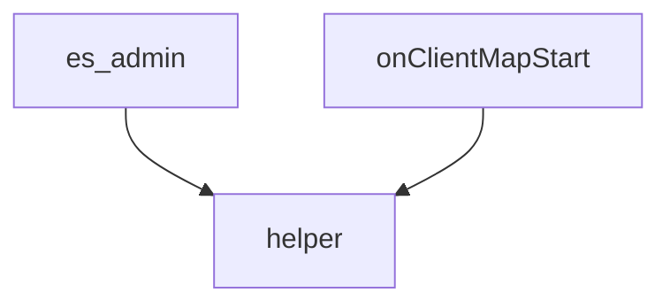

# HELPER
par @Tango & @routmoute

Update: 08/06/18
Création : 27/12/17 (628b618a)

## A FAIRE : 
 - [x] Rendre le CSS responsive à la résolution du client
 - [x] Ajout de la touche F7 pour ouvrir 
 
 ---
 
**Ressource restartable à chaud.**

### Description

Ce script affiche automatiquement une fenêtre d'aide à la connexion du joueur.

Les touches pour intéragir sont `ENTREE`, `E`, `ESC` pour fermer, `←` et `→` pour le déplacement latéral des slides.

Le helpeur peut être afficher IG avec la commande /help et la touche F7. Il s'ouvre également automatiquement à la connexion du joueur.

Ce script marche en [NUI](https://forum.fivem.net/t/how-to-use-nui-ui-creation-with-html/1127)

**Ne pas renommer index.html autrement. Seule UNE seule page html peut être chargé en NUI**

Toute les pages sont chargées dans un seul fichier HTML, et le Javascript se charge d'afficher qu'une partie à la fois, correspond à chaque page.

#### CSS

L'affichage est responsive. Il s'adapte pour les résolutions en largeur suivante:
* 1920
* 1680
* 1600
* 1440
* 1280
* 1024
* 800

Le 1024 et 800 affichent l'image `low_res.png`. 

FiveM refuse de redimensionner proportionnellement des images, alors pour éviter que le texte ne devienne illisible sur certaines parties de l'image, j'ai créée cette image pour les faibles résolutions.

L'affichage optimal est fait pour du 1920x1080.

Les élements à déplacer sont le footer, le header (logo), le h1 (titre), le h4 (numéro de page), et le container (contenant l'image).

**Le css n'est pas optimisé du tout.**

#### Fichiers:

- [+ disc_client +]  Fonctions pour ouvrir, fermer, déplacer les slides ainsi que le texte d'aide en haut à gauche.
- [+ disc_server +]  Fonction qui appelle "es:addCommand" pour ouvrir la fenêtre par le /help.
- [+ ui/index.html +]  Contenu
- [+ ui/style.css +]  Mise en page
- [+ ui/script.js +]  Pour l'effet à l'ouverture/fermeture et le défillement latéral des slides
- [+ ui/img/... +] Toute les images .png (1200x840) de background utilisé ainsi que le logo (400x400)

---

### Pages

Pour rajouter une page, coller ce code dans `index.html` et remplacer les `?` par le numéro de page:

```html
<div id="page?">
	<div class="container?">
		<header>
			<h4>?</h4>
		</header>
		<section>
			<h1>Catégorie</h1>
			<h2>TITRE</h2>
			<p>Lorem ipsum</p>
		</section>
		<footer>
			<p>Lien Discord:</p>
			<h3>discord.me/trium</h3>
			<p>Vous souhaitez nous aider ? Faites-nous un don !</p>
			<h3>streamlabs.com/piiouf</h3>
		</footer>
	</div>
</div>
```

Puis modifier tout les `?` par le numéro de la page.

L'image de fond est appelée dans le css par `<div class="container img?">`
Le `container` sert à la mise en forme de l'image.

Séparer le code par des `<section>` ce qui permet une espacement. Les `<h2>` sont pour les titres de section.

N'oubliez pas de rajouter une ligne dans **script.js** pour:
 * openSlide()
 * closeSlide()
 * nextSlide()
 * previousSlide()

Pour rajouter une image, la mettre dans `ui/img/`, la déclarer dans le `__resource.lua`, faire un nouveau `.img` dans **style.css** et modifier le `background: url`

Pour changer une image déjà existante, modifiez le `.img` correspondant et appelez le dans **index.html**.

Un container peu être appelés plusieurs fois dans **index.html** ce qui affiche la même image sur plusieurs slide.

*Une page contient toujours un container.*

#### Dépendances:
