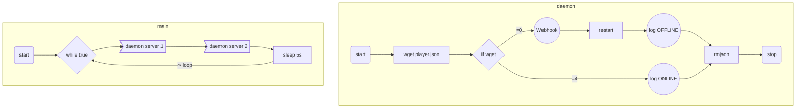

# DAEMON
###### v1.0.1

Créée par @Tango 

Update: 20/06/18

## Logs
v1.0.1
* Changement des répertoires $root

v1.0
* Création du daemon

## Description

Script *(qui peut être activé en temps que daemon)* qui redémarre automatiquement un serveur en cas de crash.

Il fait un wget et télécharge le JSON du player.JSON. Si le code de retour est autre que 0, restart en vidant le cache, puis supprime le JSON.

Si un server crash, il est loger avec le redémarrage.

Il wget toutes les 5 secs, avec 5 secondes pour restart et 5 secs après le relancement soit 15 secs max.

Un webhook est également mis en place.

Situé : `/home/rpgtafivem/gtarp/bin`

Log : `/home/rpgtafivem/gtarp/log`

## Commandes

Démarrer : `server start 0` ou `server start daemon`

Arrêter: `server stop 0` ou `server stop daemon`

Redémarrer: `server restart 0` ou `server restart daemon`

Y accéder: `server reach 0` ou `server reach daemon`

Manuellement: `screen -S DAEMON` puis `./home/rpgtafivem/gtarp/bin/daemon.sh`

## Fonctionnement

